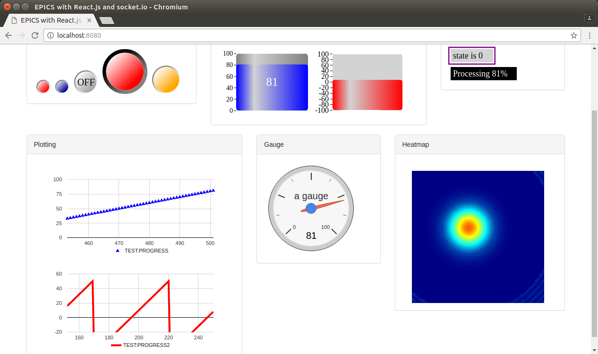

# EPICS.js
A platform for developing web UIs for EPICS IOCs using Node.JS, Socket.io and REACT.js

<p align="center"></p>


## Example widgets

#### LED
```
import Led from './led.js'

<Led pv="TEST:BLINK"/>
<Led pv="TEST:BLINK" oncolor="blue" offcolor="darkblue"/>
<Led pv="TEST:BLINK" size="60" ontext="ON" offtext="OFF" oncolor="lightgreen" offcolor="darkgrey"/>
<Led pv="TEST:BLINK" size="105" strokecolor="black" strokecolor2="grey" strokewidth="15"/>
<Led pv="TEST:BLINK" size="70" strokecolor="grey" oncolor="yellow" offcolor="orange"/>
```

#### Tank
```
import Tank from './tank.js'

<Tank pv="TEST:VALUE" scale="yes" scalestep="10" scalefontsize="10" scalecolor="red" text="${pv}" fontcolor="white" fontsize="25"/>
<Tank pv="TEST:ANOTHERVALUE" scale="yes" scalestep="40" minimum="-100" maximum="100" foreground="red" background="lightgrey"/>
```

#### Text Update
```
import TextUpdate from './textUpdate.js'

<TextUpdate pv="TEST:ASTRING width="100" pretext="state is " "/>
<TextUpdate pv="TEST:PROGRESS" background="black" fontcolor="white" width="150" pretext="Processing " posttext="%"/>
 ```

## How it works

#### Server

The server is written for Node.js and depends on https://github.com/RobbieClarken/node-epics to do the communication with EPICS IOCs.
Socket.io is then used expose PVs to the client/browser via a json object. 
The server will monitor how many clients are looking at the same PV and make sure only one socket connection is established per PV on the server side. So the client has to 'register' its PV first to tell the server to start monitoring that PV. When no client is looking at a given PV, the monitoring is closed.

Assuming you have EPICS installed and the environment variable ```NODE_EPICS_LIBCA``` is set to where the Channel Access library is installed, all you have to do is install the dependencies and run it.

```
npm install
node server.js
```

#### Client
React.js is used for the front-end doing the socket.io communication with the server and providing basics built-in widgets. 
You first have to install the dependencies (React, Socket.io, ES6 support, babel) with ```npm install```.

To build the app:
```
npm run build
```

This will compile all the component defined in ```app.js``` into ```bundle.js``` which is un turn included in the main ```index.html```


